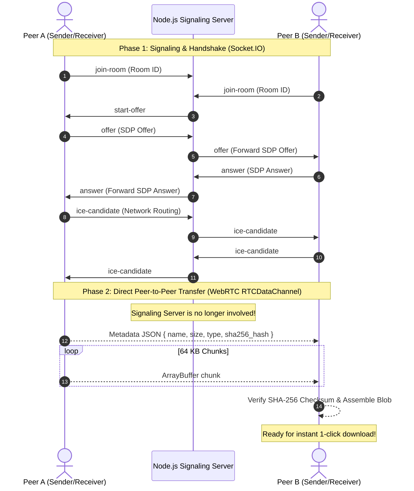

# 🌐 Meetmux — Distributed P2P File Transfer

> Ultra-fast, encrypted peer-to-peer file sharing directly between web browsers powered by WebRTC and Socket.IO. Zero cloud storage, zero file size limits, complete privacy.

---

## ⚡ Overview

**Meetmux** is a browser-to-browser direct file transfer application. Unlike traditional cloud services where files upload to a central server and then download to the recipient, Meetmux uses **WebRTC DataChannels** to establish an encrypted, direct tunnel between two peers.

Files stream directly from the sender's RAM to the receiver's RAM in small 64 KB binary chunks, followed by real-time cryptographic **SHA-256 checksum** verification upon completion.

---

## 🏗️ Architecture



---

## ✨ Features

- **🚀 Direct WebRTC DataChannel Streaming**: Ultra-low latency, bypasses server bandwidth bottlenecks.
- **🔒 True Zero-Knowledge & Zero Storage**: Server only coordinates SDP signaling; no file byte ever touches the server disk or database.
- **🛡️ End-to-End Integrity Verification**: Sender calculates a `SHA-256` digest prior to streaming; recipient re-hashes the assembled `Blob` and displays a verified status badge.
- **🔄 Bidirectional File Exchange**: Both peers in the room can send, receive, and download files simultaneously.
- **📊 Real-time Progress Tracking**: Live percentage and byte indicators for both sending and downloading peers.
- **📁 Drag-and-Drop Dropzone**: Sleek file selection with file extension badges and file size preview.
- **🔗 Shareable Room Links**: Generate an instant room code (`mux-XXXX`) or share direct URLs (`http://localhost:5173/#mux-XXXX`).
- **💎 Modern Dark Glassmorphic UI**: Tailored with Plus Jakarta Sans typography, pulsing connection indicators, and responsive card layouts.

---

## 📂 Repository Structure

```text
Meetmux/
├── backend/                  # Node.js & Socket.IO Signaling Server
│   ├── server.js             # Room pairing and WebRTC SDP/ICE signaling
│   ├── package.json
│   └── README.md
├── frontend/                 # Vite + React 18 Single Page Application
│   ├── src/
│   │   ├── components/
│   │   │   ├── JoinRoom.jsx       # Room join / Instant room creation
│   │   │   ├── TransferRoom.jsx   # WebRTC lifecycle & progress management
│   │   │   ├── SendFile.jsx       # Drag & drop upload & upload progress
│   │   │   └── ReceivedFiles.jsx  # Received files list with hash status & download
│   │   ├── App.jsx                # Header, routing, and room state
│   │   ├── App.css                # Custom modern design system
│   │   └── main.jsx
│   ├── index.html                 # Google Fonts & custom branding
│   ├── package.json
│   └── vite.config.js
├── PROGRESS.md               # Changelog and development audit trail
├── .gitignore
└── README.md
```

---

## 🚀 Getting Started

### Prerequisites

- [Node.js](https://nodejs.org/) (v18 or higher recommended)
- `npm` (comes bundled with Node.js)

### 1. Start the Backend Signaling Server

```bash
cd backend
npm install
npm start
```

The signaling server will start listening at:
```text
http://localhost:3001
```

### 2. Start the Frontend Application

In a separate terminal window:

```bash
cd frontend
npm install
npm run dev
```

The Vite development server will start at:
```text
http://localhost:5173
```

---

## 🧪 Testing File Transfer Locally

1. Open **Tab 1** in Google Chrome or Firefox: navigate to `http://localhost:5173`.
2. Click **"Create Instant Room"** (e.g. `mux-4218`).
3. Click **"Copy Link"** or note the Room ID.
4. Open **Tab 2** (or an Incognito window): navigate to the copied link or enter the Room ID and click **"Join Room"**.
5. Both tabs will display `Secured Direct P2P Tunnel Established` with a glowing green indicator.
6. Drag and drop any file into Tab 1 and click **"Send File Directly"**:
   - Tab 1 displays chunk sending progress.
   - Tab 2 displays real-time receiving progress.
   - Upon completion, Tab 2 shows `SHA-256 OK` with an instant **"Download"** button.
7. Test the reverse direction: Tab 2 can now send a file back to Tab 1.

---

## ⚙️ Technical Specifications

| Parameter | Specification | Details |
|---|---|---|
| **Chunk Size** | `64 KB` (`65,536 bytes`) | Optimal size for WebRTC buffered amount without packet drops |
| **STUN Server** | `stun:stun.l.google.com:19302` | Used for NAT traversal & ICE candidate discovery |
| **Signaling** | Socket.IO / WebSockets | Ephemeral rooms; maximum 2 peers per room |
| **Integrity** | Web Crypto API (`SHA-256`) | Cryptographic checksum computed in browser memory |
| **Binary Channel** | `binaryType = "arraybuffer"` | RTCDataChannel binary transfer |

---

## 📄 License

This project is open source and available under the [MIT License](LICENSE).
